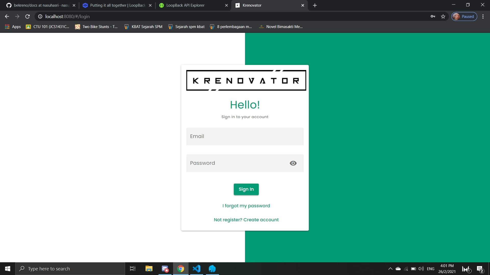

# Krenovator LMS System (Open Source)

## Overview
Krenovator LMS is a project built by students of Krenovator. It is made to enhance 
the understanding of students in real project developed in production level.
## Framework
   1. Frontend - [Quasar framework](https://quasar.dev/).
   2. Backend - Node framework which is [IBM LoopBack Version 4](https://loopback.io/).

## Database
Database used in this project: MySQL

## Side Notes
1. Highly recommend if you can start from backend(bekreno) installation for better understanding.

## Getting Started & Installation

1. Open your github and fork these repos:
   - https://github.com/iqbalbaharum/bekreno
   - https://github.com/iqbalbaharum/fekreno

2. Create new folder and open git bash

3. Copy link of the repos in your github. Make sure your directory is correct then insert this command with the link of repo.
   - Command: *git clone link-of-repo*.
   - Example path: C:\Users\nasuha\Desktop\proKreno>
## Fekreno Installation
1. Open terminal and go to fekreno folder
   Command: cd fekreno

2. Create .env file and put these in the file - to connect backend(bekreno) and frontend(fekreno)
   MAIN_BE_URL=http://localhost:3000/
   MAIN_BE_TOKEN=jwt

3. Install frontend dependency:
   Command: *npm ci*

3. Install quasar cli to ensure you can use quasar command:
   Command: *npm install -g @quasar/cli*
   
4. To run the frontend: *quasar dev*

5. Result:

